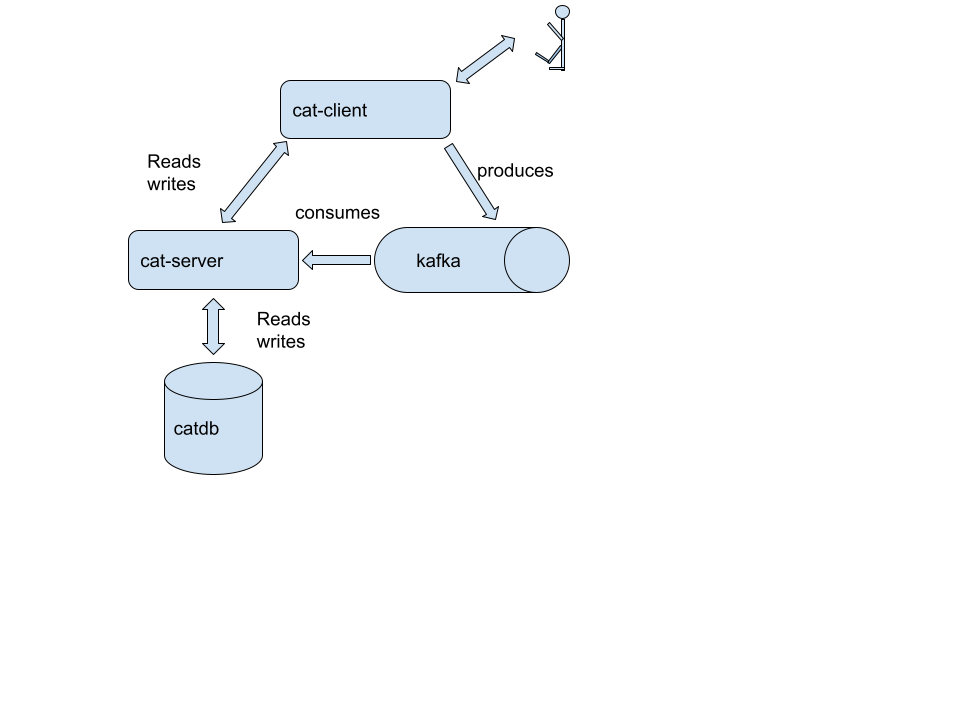

# Contributor's guide
Thank you so much for your interest in contributing to this game. There are several areas which requires contributions:
- Game graphics (an animated player sprite would be awesome)
- Game sounds and sfx (there are none so far)
- New / updated levels (see the [tiled](./tiled/README.md) folder for instructions)
- JavaScript client codings for several areas, features
- Java server codings 

If you want to contribute to this game, please feel free so by first of all fork this repository, set up your required local dev stack and then create a branch where you are coding against. Then create a pull request against the "main" branch of this repository. 

## Setting up your local environment
### Compiling & Running server
First you need to startup the server by getting into `quarkus-server` and executing:
```shell script
cd quarkus-server
./mvnw compile quarkus:dev
```

### Compiling & Running client
Then you need to open another terminal window and need to get into the client and executing:
```shell script
cd melonjs-client
npm install
npm run dev
```

Make sure that the `environment` variable in `melonjs-client/src/config.js` is set to `local`. 

You need a current version of the [Java SDK](https://adoptium.net/). And you also need to have a current version of [Apache Maven](https://maven.apache.org). 

## Overall architecture of this game
The following diagram shows you the overall 100000 feet architecture of this game. 


### The cat-client
The client is 100% a browser based JavaScript application. The 