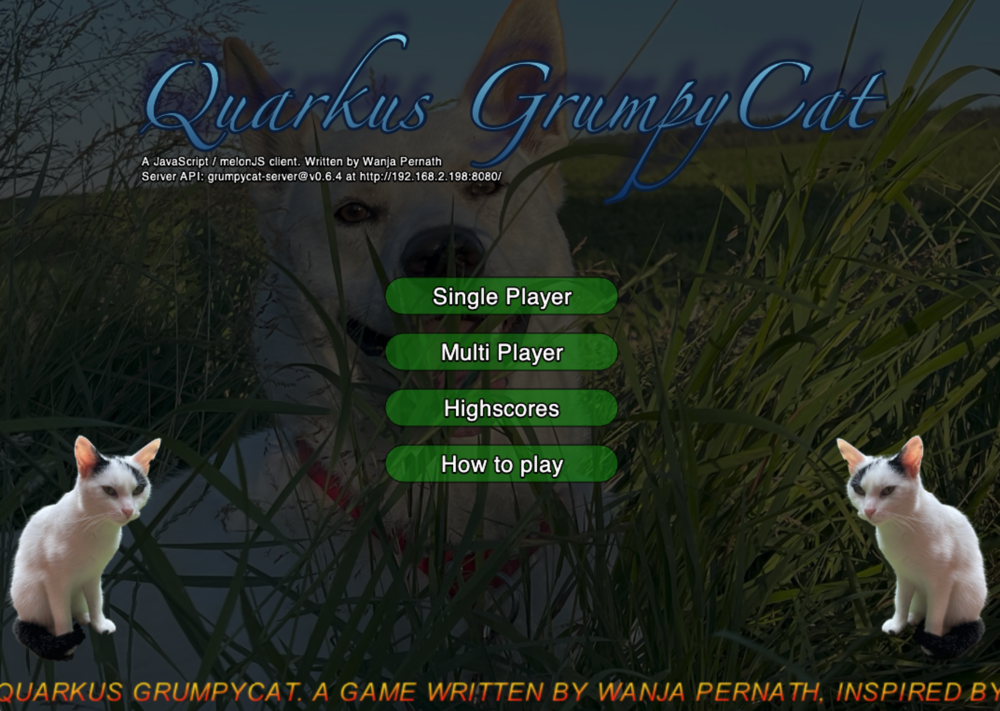
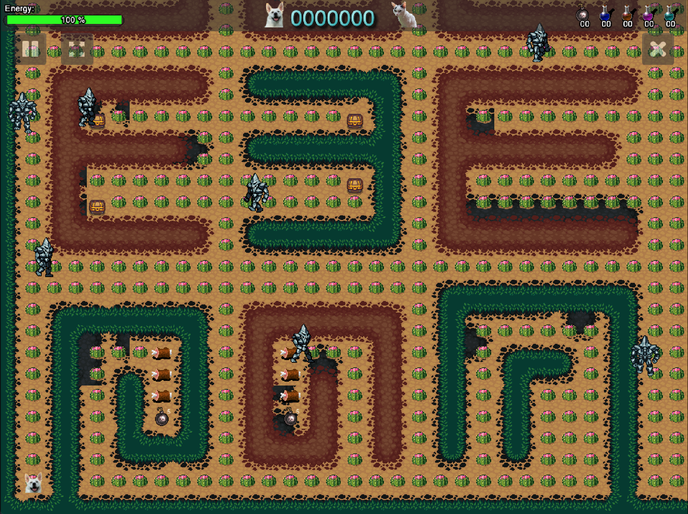
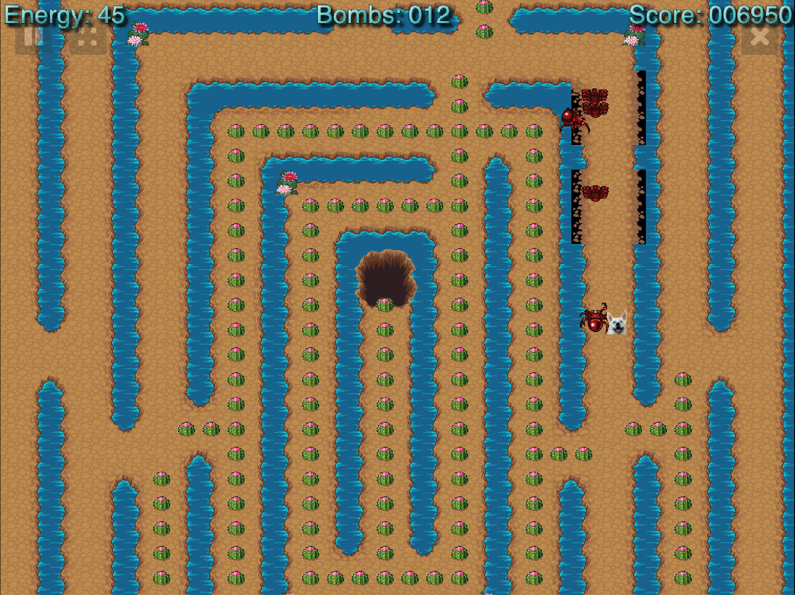
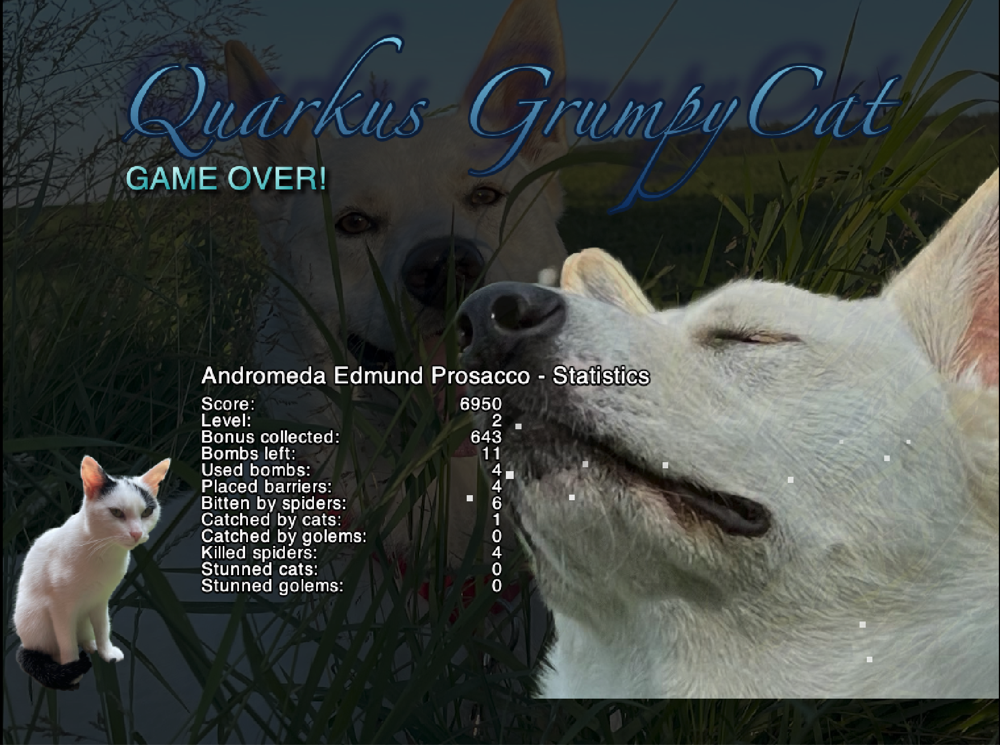

# quarkus-grumpycat game

This Game uses Quarkus, the Supersonic Subatomic Java Framework and HTML 5 / JavaScript.

If you want to learn more about Quarkus, please visit its website: https://quarkus.io/ .

All client game logic is currently coded with JavaScript and [MelonJS](https://github.com/melonjs/melonjs).

## The Game

This game was inspired by the old Fat-Cat game and by PacMan. You're controlling a dog in a maze which needs to eat all food without being caught by a grumpy cat or other enemies. 

### How to play (single player)
Right now you can control the dog with arrow keys UP, DOWN, LEFT & RIGHT and with W, A, S, D. More keys are:

- *P* PAUSE
- *SPACE* place bomb
- *Shift* + UP/DOWN/LEFT/RIGHT: place barrier in the direction
- *ALT | option* + UP/DOWN/LEFT/RIGHT: throw a magic bolt into the direction, killing spiders or stunning other enemies (cats, golems).
- *Q* start a magic firespin around your player. Any other player / enemy coming too close to you will be stunned / killed (depending on the enemy). Spell is up for 15sec
- *E* start a magic protection circle around your player. No other players / enemies could harm you for 15sec.
- *R* place a magic nebula at the place you are right now. Path finding enemies (cats, spiders) will walk to this place and get damaged / stunned. Spell is up for 15sec.

If the cat gets into an exploding bomb, it stops for 3sec. A bomb can destroy barriers. The level ends if you got all food or if you don't have any energy left.

In order to use those weapons, you have to collect them in form of a magic potion or in form of a bomb first. 
  
### How to play (multi player)
You can start the game in multi player modus. Up to 4 players are able to play against each other. 
You can place bombs, throw magic bolts and cast the magic firespin to harm other players. If you're hurting others, you also get points.

In multi player mode a level ends if either all bonus is collected or if you are the last player standing. The winner is that player with the highest score. 


### Bonus tiles
There are different bonus tiles to be collected. 
- Pill (looks like a cactus): 10 Pts
- Bomb: 50 Pts, add 5 bombs to your inventory
- Meat: 25 Pts, add 25 points more energy
- Cheese: 15 Pts, add 20 points more energy
- Chest: 250 Pts, add a random weapon to your inventory (does NOT count for level end!)
- Potion: 50 Pts
  - Small red: maxEnergy + 25
  - Big red: maxEnergy + 50
  - Blue: +3 magic bolts 
  - brown: +3 magic firespins
  - green: +3 magic protection circles
  - violet: +3 magic nebula

### Life demo
There is a demo of this game running [here](http://cat-client-grumpycat.apps.ruby.rhepds.com). 
Please note, that I am using this server also for workshops etc. So the system might not be as stable as expected. But you can give it a try.

If you have any suggestestions or want to contribute, please open an [issue here](https://github.com/wpernath/quarkus-grumpycat/issues). Thank you!


### Game Graphics







## What's NEW?
Starting with v0.6.0, there is a multi player mode where up to 4 players can play against each other via network on specialized multi player maps (right now just 2 of them). 

The game is over if:
- All bonus items have been collected
- All other players left the game (intentionally or unintentionally)

The winner of the match is the player who has a higher score than all others or who has survived all others. 

- Players can drop bombs to other players to hit them (-50 Energy, plus 100 score). 
- Players can lock other players by throwing a barrier into the way (those can be destroyed with a bomb)

And do not forget: There are still other enemies who can hit you!

### Future of multi player
I am currently working on specialied multi player features for the player
- A magic bolt (flying into the direction where they were fired, killing or stunning enemies and players)
- A magic protection shield around yourself (15 seconds). Enemies or other players can't hurt you
- A magic fire circle around yourself (15 seconds or hitting up to 5 enemies / players). 
- A magic invisible nebula around yourself (enemies can see and thus can't attack you, enemies might find another player to attack them in this time)


## Running the applications in dev mode

First you need to startup the server by getting into `quarkus-server` and executing:
```shell script
cd quarkus-server
./mvnw compile quarkus:dev
```

Then you need to open another terminal window and need to get into the client and executing:
```shell script
cd melonjs-client
npm install
npm run dev
```

Make sure that the `environment` variable in `melonjs-client/src/config.js` is set to `local`. 

## Running on Docker / Podman
There are container images ready to be used on [Quay.io](https://quay.io/wpernath/quarkus-grumpycat). Use this command to pull the images to your local repository:

```shell
docker pull quay.io/wpernath/quarkus-grumpycat
docker pull quay.io/wpernath/grumpycat-melonjs
```

To run the server, the required database and the client, you need to have Docker / Podman configured and running. You can use the `docker-compose.yaml` to start the latest version of the game:

```shell
docker-compose [--detach|-d] up
```

The app is then available under `http://localhost:8085` in your browser.


## Running on Kubernetes / OpenShift

### OpenShift / Kubernetes image deployment in a GitOps way
There are precompiled images available on `quay.io/wpernath/quarkus-grumpycat`. You can either use `latest` tag or use one of the `vx.y.z` tags.

NOTE, for this approach, you need to have the following Operators installed in your OpenShift / Kubernetes cluster:

- [Crunchy Data Postgres Operator](https://operatorhub.io/operator/postgresql)
- [Strimzi Kafka Operator](https://operatorhub.io/operator/strimzi-kafka-operator)  

Just have a look into the [kubernetes-config directory](kubernetes-config). Then apply the `overlays/dev` configuration as usual, after making sure the config maps are set according to your target namespace

```shell
oc login <log into your openshift cluster>
oc new-project grumpy-test
oc apply -k kubernetes-config/overlays/dev
```

This will automatically install a database, the Kafka service and the latest DEV versions of the App.

To delete the app, use:

```shell 
oc delete -k kubernetes-config/overlays/dev
```


### Using full featured GitOps
To make use of all GitOps features, have a look at the `gitops` folder of this project. 

Your OpenShift / Kubernetes cluster needs to have the following Operators installed (in addition to Strimzi and Crunchy PGO):

- [OpenShift Pipeline (or Tekton Pipeline)](https://operatorhub.io/operator/tektoncd-operator)
- [OpenShift GitOps (or an ArgoCD instance)](https://operatorhub.io/operator/argocd-operator)

To install the `cat-ci` project, call:

```shell
./gitops/tekton/pipeline.sh init \
	--force \
	--git-user <your git user> \
	--git-password <your git password> \
	--registry-user <your quay.io user> \
	--registry-password <your quay.io password>
```

To install the `cat-dev` and `cat-stage` projects, call

```shell
oc apply -k ./gitops/argocd
```

To start a pipeline build, call

```shell
./gitops/tekton/pipeline.sh build \
	-u <your quay.io user>
	-p <your quay.io password>
```

To stage your version of quarkus-grumpycat, call something like

```shell
./gitops/tekton/pipeline.sh stage -r v0.2.4
```

This creates a new branch in github.com and tags the current images on quay.io.

## Roadmap

- In the near future there will also be an EnemyMovementResource to store - well - the enemy's movements, as my plan to calculate new positions of the enemies based on current PlayerMovement doesn't work properly (timing issue).

- Refactoring of the JavaScript stuff. I mainly have used this project to learn some JavaScript. Now it's time to refactor everything and to use some more fancy methods to do the same.

- Do not directly use the Player- / EnemyMovement to store the data in the database, but use Apache Kafka or Streams to take the data and then use a Consumer to store the data asynchronously in the database. 

## About the graphics
The map graphics are coming from [LPC Terrain](https://opengameart.org/content/tiled-terrains) and all its authors. Special thanks to all of them!
                    
