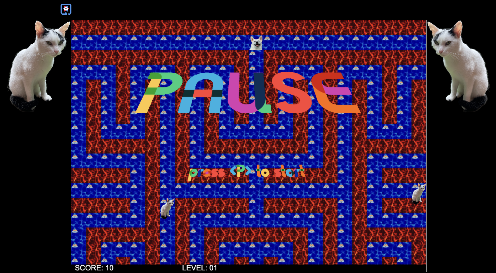

# quarkus-grumpycat game

This Game uses Quarkus, the Supersonic Subatomic Java Framework and HTML 5 / JavaScript.

If you want to learn more about Quarkus, please visit its website: https://quarkus.io/ .

## The Game

This game was inspired by the old Fat-Cat game and by PacMan. You're controlling a dog in a maze which needs to eat all food without being caught by a grumpy cat. 

Right now you can control the dog with arrow keys UP, DOWN, LEFT & RIGHT and with W, A, S, D. More keys are:

- *P* PAUSE
- *SPACE* place bomb
- *Shift* + UP/DOWN/LEFT/RIGHT: place barrier in the direction

If the cat gets into an exploding bomb, it stops for 3sec. A bomb can destroy barriers. The game ends if you got all food.
  

Game logic is currently coded with JavaScript. 



## Running the application in dev mode

You can run your application in dev mode that enables live coding using:
```shell script
./mvnw compile quarkus:dev
```

## Game Server
The server part currently only consists of a HTML server serving index.html and the various scripts in JavaScript. It also contains `MapResource.java` which will be called to download a level. 

Future of this project is to let the enemy's new positions be calculated by the server as well (`EnemyResource.java`).

## Game Logic
Currently, the complete game logic (including drawing the silly graphics) is being done in JavaScript. 

- `game-logic.js` contains the full game logic. `setupGame()` will be called by the `onLoad` event of the `index.html` file.

- `game-structs.js` contains some helper classes and global constants for the game like the Player class, the Camera, the Enemy class etc. 

- `game-tiled-renderer.js` contains the logic to load and parse a map in the format of [Tiled MapEditor](https://mapeditor.org) and to draw the map with all its layers and player / enemies.

### `game-logic.js`: initLevel()
This function will be called whenever the level needs to be initialized (upon game start, after gameover or gamewon). It calls the `MazeResource.java` to download the level and prepares the local game logic. 

### `game-logic.js`: gameLoop()
This function will be called by `window.requestAnimationFrame()` whenever the browser has time to play the game. It acts as the main game method and makes sure, the player moves, the cat tries to catch the dog, etc.

### `game-logic.js`: drawMaze() 
This function draws the currently visible part of the maze based on level data read from server. After drawing the maze, it places the enemies in the maze (if visible) and draws the dog (the player).


### `game-logic.js`: updatePlayer()
This function makes sure, the dog moves according to the keys pressed. It also makes sure, the dog doesn't move on tiles which should act as walls etc. 

### `game-logic.js`: updateEnemy() 
This function calculates the shortest path between each enemy and the dog. It just calculates the next possible move for each cat based on a simple Lee Algorythm. If there is no direct path between the cat and the player, it follows the logic: walk in a random walkable direction until you hit a border, then choose another random walkable direction. 

